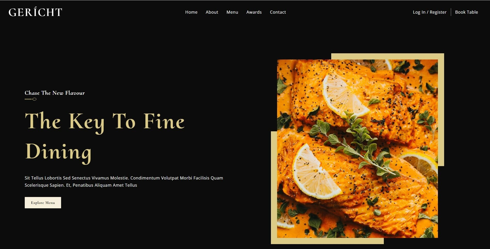

# Gerich Restaurant

Welcome to the Gerich Restaurant project repository! This project aims to create a website for a restaurant called Gerich, using the React.js framework. Users can view the restaurant's menu, make reservations, and explore various features.

## Table of Contents

- [Project Description](#project-description)
- [Features](#features)
- [Installation](#installation)
- [Usage](#usage)
- [Contributing](#contributing)
- [License](#license)

## Project Description

The Gerich Restaurant project is built using [React.js](https://reactjs.org/), a JavaScript library for building user interfaces. It follows a component-based architecture and leverages other libraries and tools such as [React Router](https://reactrouter.com/) for routing and [React Hooks](https://react.dev/reference/react#state-hooks) for state management.

## Features

1. **Menu**: Browse the restaurant's menu, categorized into various sections such as appetizers, main courses, desserts, videos etc.
2. **Responsive Design**: The website is designed to be mobile-friendly and compatible with different screen sizes.

## Installation

To run this project locally, follow these steps:

1. Clone the repository:

   git clone https://github.com/Joniqs/gerich_restaurant.git

2. Change into the project directory:

   cd gerich_restaurant

3. Install the required dependencies:

   npm install

4. Start the development server:

   npm start

5. Visit `http://localhost:3000` in your web browser to access the Gerich Restaurant website.

## Usage

Once you have the project up and running, you can access various features through the website's user interface.

## Contributing

Contributions to the Gerich Restaurant project are always welcome. If you find any issues or have ideas for improvements, please submit an issue or create a pull request. Ensure that you adhere to the project's coding style and guidelines.

## License

This project is licensed under the [MIT License](LICENSE).
